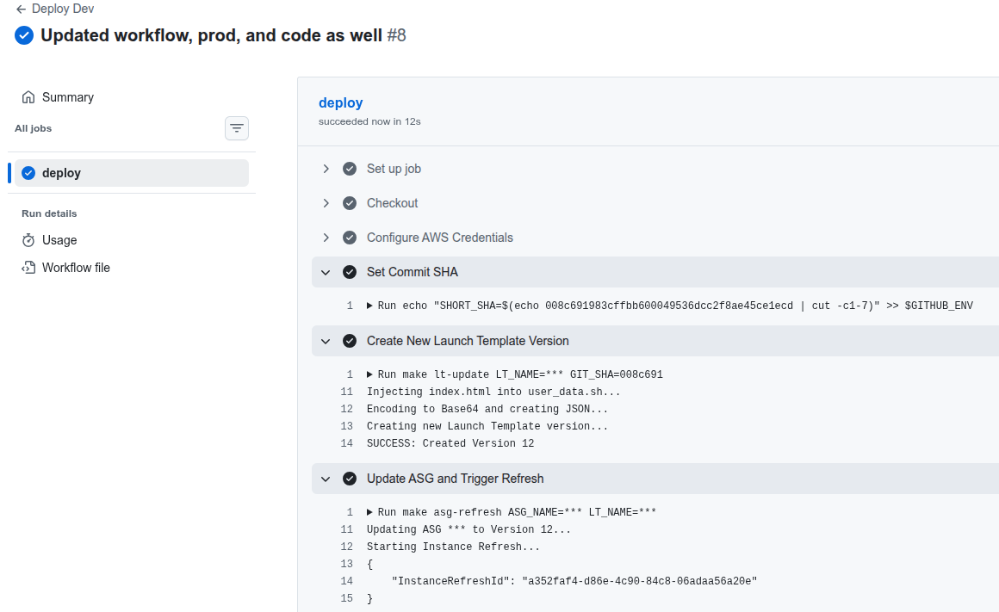
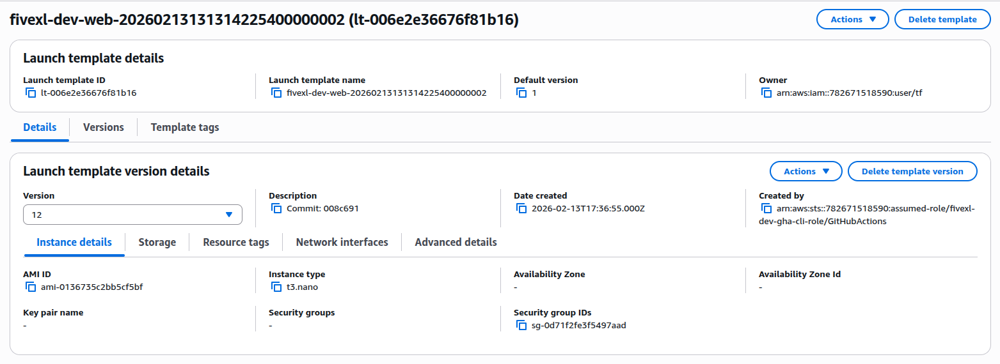
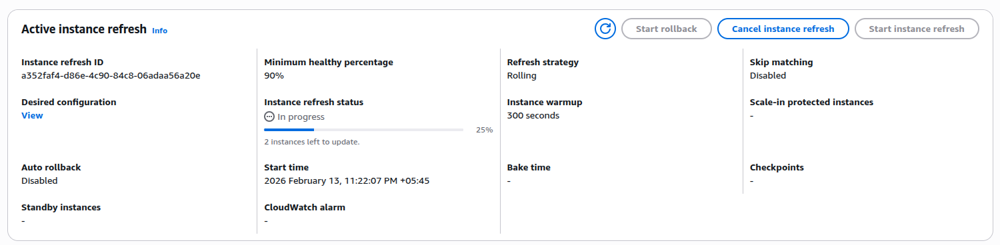
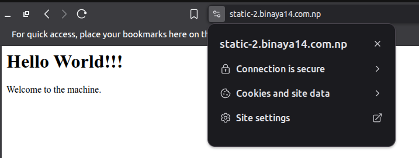

# static-hosting-2

Static website hosting infrastructure on AWS using Launch Templates, Auto Scaling Group, and Application Load Balancer with automated GitHub Actions deployment.

## Architecture

```
                                    Internet
                                        |
                                        |
                                        v
                        +-------------------------------+
                        |      Internet Gateway         |
                        +-------------------------------+
                                        |
                                        v
                        +-------------------------------+
                        |      ALB (Application LB)      |
                        |   (HTTPS: 443, HTTP: 80)      |
                        |   Domain: static-2.binaya14   |
                        |        .com.np                 |
                        +-------------------------------+
                                        |
                              (Security Group: 80/443)
                                        |
                                        v
                        +-------------------------------+
                        |     ASG (Auto Scaling Group)  |
                        |   Min: 1 | Max: 3 | Desired: 1 |
                        +-------------------------------+
                                        |
                        +---------------+---------------+
                        |               |               |
                        v               v               v
                +-----------+   +-----------+   +-----------+
                |  Public   |   |  Public   |   |  Public   |
                |Subnet 1  |   |Subnet 2  |   |Subnet 3  |
                |10.0.0.0/24|   |10.0.1.0/24|   |10.0.2.0/24|
                +-----------+   +-----------+   +-----------+
                        |               |               |
                        v               v               v
                        NATGW           NATGW           NATGW
                        |               |               |
                        +---------------+---------------+
                                        |
                        +---------------+---------------+
                        |               |               |
                        v               v               v
                +-----------+   +-----------+   +-----------+
                |  Private  |   |  Private  |   |  Private  |
                |Subnet 1  |   |Subnet 2  |   |Subnet 3  |
                |10.0.10.0/24|  |10.0.11.0/24|  |10.0.12.0/24|
                +-----------+   +-----------+   +-----------+
                        |               |               |
                        v               v               v
                    +-------+       +-------+       +-------+
                    | EC2   |       | EC2   |       | EC2   |
                    | Nginx |       | Nginx |       | Nginx |
                    +-------+       +-------+       +-------+
                        |               |               |
                        +---------------+---------------+
                                        |
                                        v
                        +-------------------------------+
                        |            VPC                |
                        |       10.0.0.0/16             |
                        +-------------------------------+

┌─────────────────────────────────────────────────────────────────────────────┐
│                           GitHub Actions                                    │
│                                                                             │
│   ┌──────────────┐    ┌──────────────────┐    ┌────────────────────────┐    │
│   │  Push to     │───▶│  OIDC Auth       │───▶│  Create LT Version     │    │
│   │  code/**     │    │  (sts.amazonaws) │    │  (index.html update)   │    │
│   └──────────────┘    └──────────────────┘    └────────────────────────┘    │
│                                                           │                 │
│                                                           ▼                 │
│                                                  ┌────────────────────────┐ │
│                                                  │  Update ASG +          │ │
│                                                  │  Instance Refresh      │ │
│                                                  └────────────────────────┘ │
└─────────────────────────────────────────────────────────────────────────────┘
```

## Infrastructure Components

### Network
| Component | Details |
|-----------|---------|
| VPC | `10.0.0.0/16` with DNS hostnames enabled |
| Public Subnets | 3 subnets across availability zones (`10.0.0.0/24`, `10.0.1.0/24`, `10.0.2.0/24`) |
| Private Subnets | 3 subnets across availability zones (`10.0.10.0/24`, `10.0.11.0/24`, `10.0.12.0/24`) |
| NAT Gateways | One per public subnet for outbound internet access |
| Internet Gateway | Provides internet connectivity to public subnets |

### Security Groups
| Security Group | Ingress Rules | Egress Rules |
|----------------|---------------|--------------|
| ALB Security Group | HTTP (80), HTTPS (443) from `0.0.0.0/0` | All traffic to `0.0.0.0/0` |
| Web Security Group | HTTP (80) from ALB SG only | All traffic to `0.0.0.0/0` |

### Compute
| Component | Details |
|-----------|---------|
| Launch Template | Ubuntu 24.04 LTS (Noble), `t3.micro`, GP3 storage |
| Auto Scaling Group | Min: 1, Max: 3, Desired: 1 |
| Health Checks | ELB-based, 5-minute grace period, `/health` endpoint |

### Load Balancer
| Feature | Configuration |
|---------|--------------|
| Type | Application Load Balancer (Application) |
| Scheme | Internet-facing |
| Listeners | HTTP (80) → HTTPS redirect, HTTPS (443) with ACM certificate |
| Routing | Host-based routing for `static-2.binaya14.com.np` |
| Security | Default HTTPS action returns 403 (deny all) |
| Health Check | HTTP on port 80, path `/health` |

### SSL/TLS
- Certificate: AWS ACM (Amazon Certificate Manager)
- Domain: `static-2.binaya14.com.np`

### IAM & Security
- **OIDC Provider**: GitHub Actions authenticated via `token.actions.githubusercontent.com`
- **IAM Role**: Restricts permissions to specific repository (`repo:BS14/static-hosting-2:*`)
- **Instance Metadata**: IMDSv2 required, instance metadata tags enabled

## CI/CD Workflow

### Trigger
- **Automatic**: Push changes to `code/**` files
- **Manual**: `workflow_dispatch` (via GitHub UI)

### Deployment Process
1. **Checkout**: Fetch repository code
2. **Configure AWS Credentials**: Use OIDC role assumption (`secrets.OIDC_ROLE_DEV`)
3. **Create Launch Template Version**: Inject new `index.html` content via Makefile
4. **Update ASG**: Point ASG to new launch template version
5. **Instance Refresh**: Rolling update with 50% minimum healthy capacity

### GitHub Secrets Required
| Secret | Description |
|--------|-------------|
| `OIDC_ROLE_DEV` | IAM role ARN with permissions to update LT and ASG (Dev) |
| `LT_NAME_DEV` | Launch Template name (e.g., `fivexl-dev-web-launch-template`) |
| `ASG_NAME_DEV` | Auto Scaling Group name (e.g., `fivexl-dev-web-asg`) |
| `OIDC_ROLE_PROD` | IAM role ARN with permissions to update LT and ASG (Prod) |
| `LT_NAME_PROD` | Launch Template name for Prod (e.g., `fivexl-prod-web-launch-template`) |
| `ASG_NAME_PROD` | Auto Scaling Group name for Prod (e.g., `fivexl-prod-web-asg`) |

## Repository Structure

```
static-hosting-2/
├── code/
│   ├── index.html          # Static website content
│   └── scripts/
│       └── user_data.sh    # EC2 user data script template
├── infra/
│   ├── dev/
│   │   ├── main.tf         # Root Terraform module
│   │   ├── variables.tf    # Terraform variables
│   │   ├── provider.tf    # AWS provider configuration
│   │   └── backend.tf     # Terraform backend (S3)
│   ├── prod/
│   │   ├── main.tf         # Root Terraform module (Prod)
│   │   ├── variables.tf    # Terraform variables
│   │   ├── provider.tf    # AWS provider configuration
│   │   └── backend.tf     # Terraform backend (S3)
│   └── modules/
│       ├── acm/            # ACM certificate module
│       ├── asg/            # Auto Scaling Group module
│       ├── lb/             # Application Load Balancer module
│       ├── launch_template/# Launch Template module
│       ├── network/        # VPC, subnets, NAT GW, routing
│       ├── oidc/           # GitHub OIDC provider & IAM role
│       └── sg/             # Security Group module
├── .github/
│   └── workflows/
│       ├── dev.yaml        # GitHub Actions workflow (Dev)
│       └── prod.yaml       # GitHub Actions workflow (Prod)
├── images/                 # Architecture and deployment screenshots
├── Makefile                # Deployment automation scripts
└── README.md               # This file
```

## Prerequisites

- AWS Account with appropriate permissions
- GitHub repository with GitHub Actions enabled
- Domain name with Route 53 hosted zone (for ACM validation)

## Deployment

### Initial Infrastructure Setup
```bash
cd infra/dev
terraform init
terraform plan
terraform apply
```

### Update Website Content
Simply push changes to `code/index.html`:
```bash
git add code/index.html
git commit -m "Update website content"
git push origin main
```

The GitHub Actions workflow will automatically:
1. Create a new Launch Template version
2. Update the ASG to use the new version
3. Trigger a rolling instance refresh

### Manual Deployment
```bash
# Set environment variables
export LT_NAME=fivexl-dev-web-launch-template
export ASG_NAME=fivexl-dev-web-asg

# Run the deployment
make lt-update GIT_SHA=$(git rev-parse --short HEAD)
make asg-refresh
```

## Variables

| Variable | Default | Description |
|----------|---------|-------------|
| `env` | `dev` | Environment name |
| `project` | `fivexl` | Project name |
| `cidr` | `10.0.0.0/16` | VPC CIDR block |
| `instance_type` | `t3.micro` | EC2 instance type |

## Outputs

After `terraform apply`, the following outputs are available:
- `asg_name`: Auto Scaling Group name
- `launch_template_id`: Launch Template ID 
- `oid_role`: Github Role.

## Security Considerations

- **Network**: Private instances have no public IP, access via ALB only
- **Security Groups**: Web instances only accept traffic from ALB security group
- **IAM**: OIDC role has scoped permissions (no wildcard `*` except for Launch Template)
- **Instance Metadata**: IMDSv2 required (prevents SSRF attacks)
- **HTTPS**: HTTP automatically redirects to HTTPS
- **ACM Certificate**: Managed SSL/TLS with automatic renewal

## Screenshots

### GitHub Actions Workflow


### Launch Template Updates


### Instance Refresh


### Running Website

